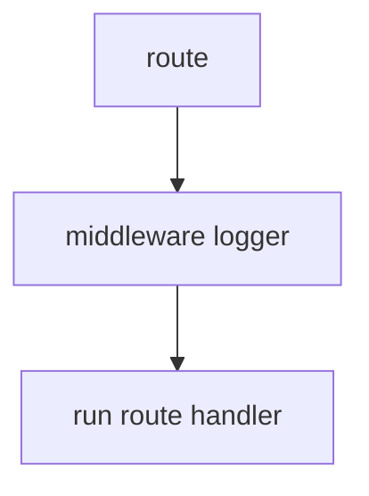

# Async Project

## Promise
## File Handling

### Project Configuration
```
npm install
```

```
npm run dev
```


```mermaid

graph TD

A[route]-->B[middleware logger]
B-->C[run route handler]

```